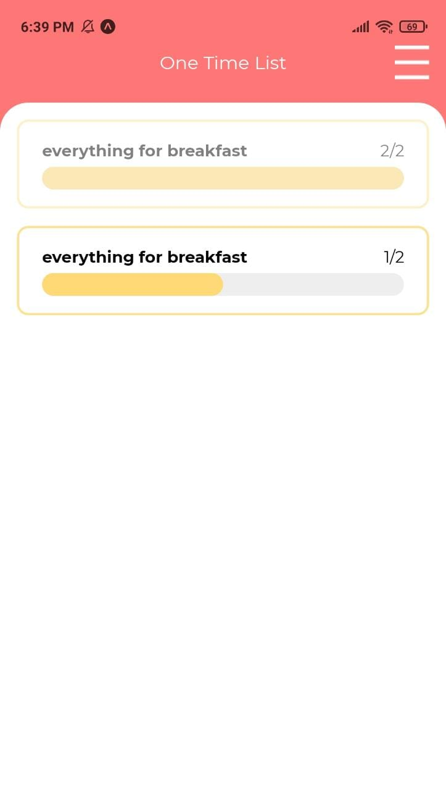
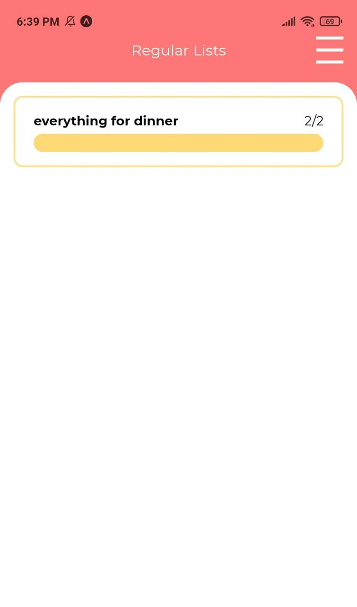
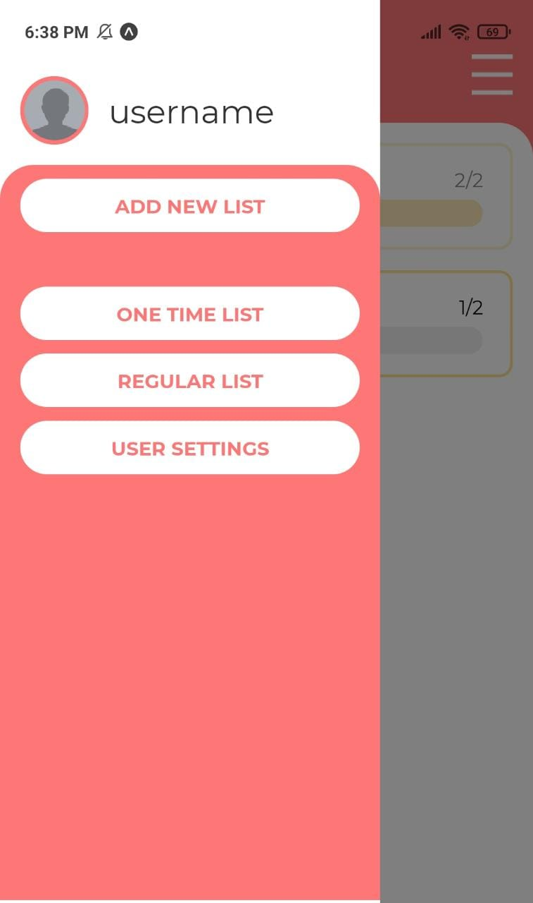
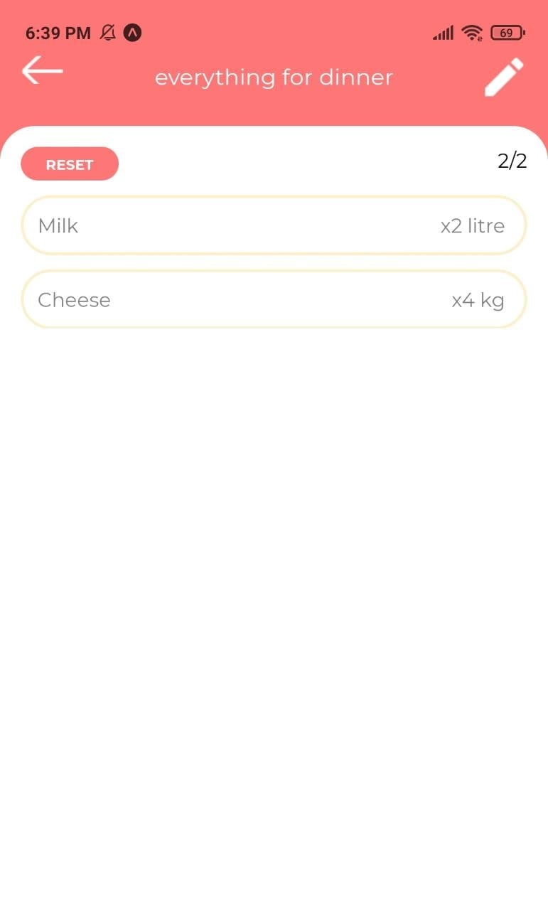
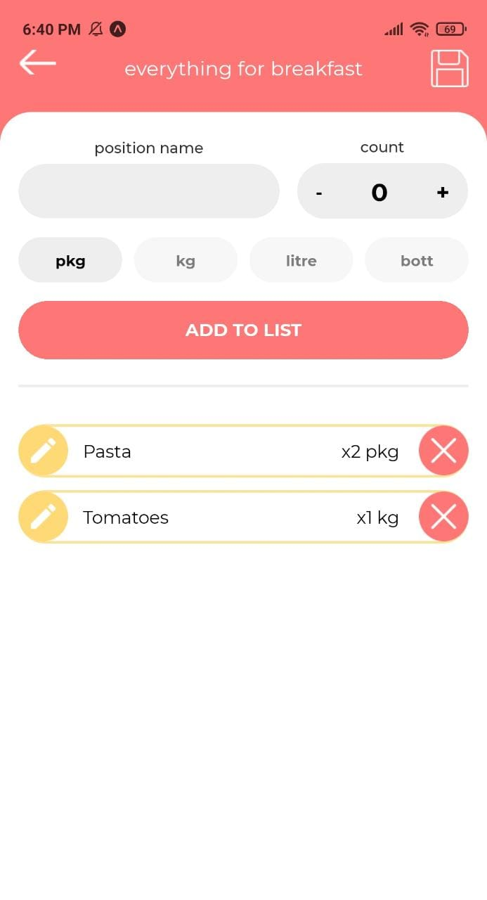
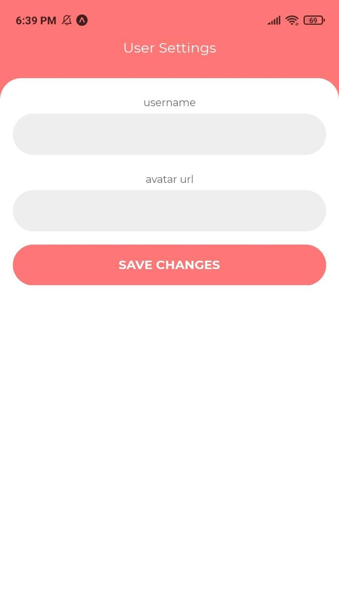
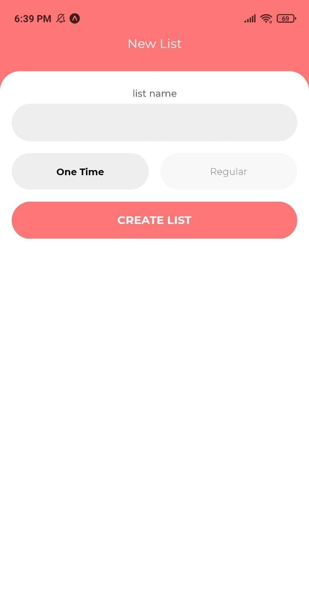

# shop-list-app
Shop-list mobile app built with React Native,Redux

<h2>one time list</h2>

<h2>regular list</h2>

<h2>drawer menu</h2>

<h2>list items</h2>

<h2>edit list items</h2>

<h2>user setting</h2>

<h2>create new list</h2>

